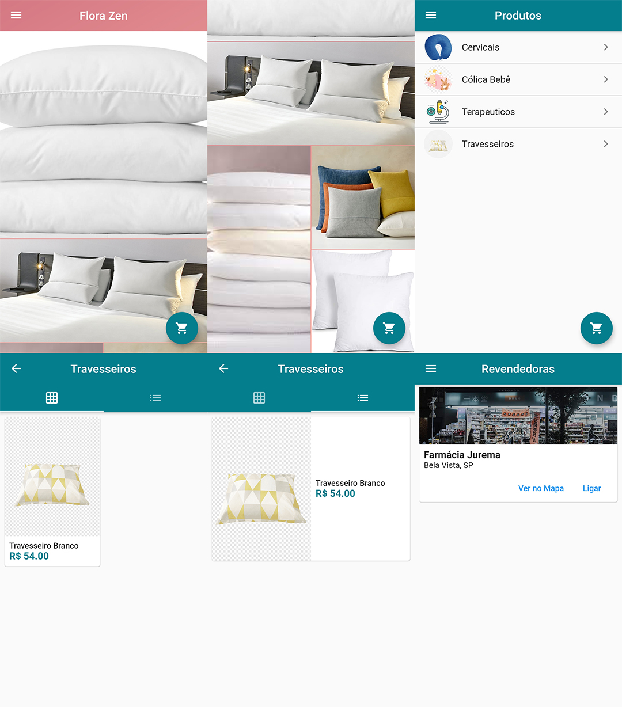

# Virtual Shop

  An app for selling aromatic pillows. The purpose of this project is to learn how to use the connection of the firestore with the flutter.

## !Disclaimer!

It's a project using flutter framework and firestore database, unfortunately the firestore expired because the date on the rules. If the IDE you are using does not give the debugging release, go to the terminal and type

`admin lojavirtual % flutter clean`

and clean cache.

## Screenshots

## Description

In this project, you will see login screens, products, requests, list of pharmacies and cart.

## My Contacts

- [LinkeDin](https://www.linkedin.com/in/juan-jurado-b87036141/)
- [GitHub](https://github.com/JuanCalavera)

